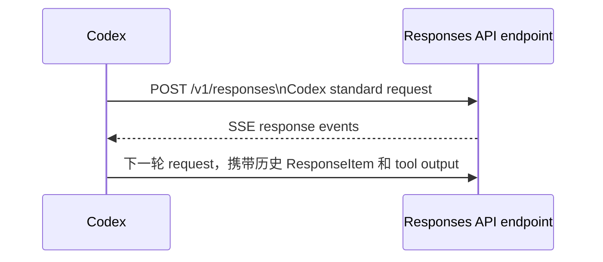

# Codex Responses API Schema

## 1. 调研基准

- 基准实现：`/Users/groos/KnowledgeBase/codex`
- Codex revision：`646f7c0a91`
- 主要代码：`codex-rs/codex-api`、`codex-rs/protocol/src/models.rs`、`codex-rs/core/src/client.rs`
- 本文描述的是 Codex 当前使用的 Responses API wire contract，不是 app-server 的 JSON-RPC contract。

本文按 Codex 客户端视角描述两个方向：

- 出站 request：Codex -> `/v1/responses` endpoint。endpoint 可以是本地 proxy，也可以是其他 Responses API provider。
- 入站 response：`/v1/responses` endpoint -> Codex，实际以 SSE event stream 为主。

Codex 没有把完整 Responses API `Response` 定义成一个强类型返回结构。它逐个解析 SSE event，并对 output item、completed usage 等局部 payload 使用强类型；未知 event 和未知字段需要保持可兼容。

## 2. 交互流程



当模型产生工具调用时，通常流程为：

1. provider 返回 `function_call` 或 `custom_tool_call` output item。
2. Codex 执行工具。
3. Codex 将 `function_call_output` 或 `custom_tool_call_output` 放入下一次 request 的 `input`。

## 3. Codex 出站标准 request

### 3.1 HTTP

```http
POST /v1/responses
Content-Type: application/json
Accept: text/event-stream
Authorization: Bearer <token>
```

Codex API client 对 request body 的入口是 `ResponsesApiRequest`，对应代码为 `codex-api/src/common.rs:252-275`；HTTP endpoint 在 `codex-api/src/endpoint/responses.rs:69-133`。

请求头中还可能出现以下 Codex 会话信息：

| Header | 作用 | 来源 |
| --- | --- | --- |
| `x-client-request-id` | 当前 thread id | `ResponsesOptions.thread_id` |
| `session-id` | 当前 session id | `ResponsesOptions.session_id` |
| `thread-id` | 当前 thread id | `ResponsesOptions.thread_id` |
| `x-openai-subagent` | sub-agent 来源 | `session_source` |
| `x-codex-turn-state` | 同一 turn 的 sticky routing state | 上一次 response header |

这些 header 不属于 JSON request schema。Codex API client 会在 `ResponsesOptions` 和 provider 配置基础上生成/附加它们。

### 3.2 顶层 request schema

下面是按 Codex 序列化行为整理的兼容 schema。`required` 表示 Codex 的 `ResponsesApiRequest` 会生成该字段；带 `skip_serializing_if` 的字段在空值时会被省略。

```json
{
  "$schema": "https://json-schema.org/draft/2020-12/schema",
  "$id": "codex-responses-request",
  "type": "object",
  "required": [
    "model",
    "input",
    "tool_choice",
    "parallel_tool_calls",
    "reasoning",
    "store",
    "stream",
    "include"
  ],
  "properties": {
    "model": { "type": "string" },
    "instructions": { "type": "string" },
    "input": {
      "type": "array",
      "items": { "$ref": "#/$defs/response_item" }
    },
    "tools": {
      "type": "array",
      "items": { "type": "object" }
    },
    "tool_choice": { "type": "string" },
    "parallel_tool_calls": { "type": "boolean" },
    "reasoning": {
      "anyOf": [
        { "$ref": "#/$defs/reasoning" },
        { "type": "null" }
      ]
    },
    "store": { "type": "boolean" },
    "stream": { "type": "boolean" },
    "stream_options": {
      "anyOf": [
        { "$ref": "#/$defs/stream_options" },
        { "type": "null" }
      ]
    },
    "include": {
      "type": "array",
      "items": { "type": "string" }
    },
    "service_tier": {
      "anyOf": [
        { "type": "string" },
        { "type": "null" }
      ]
    },
    "prompt_cache_key": {
      "anyOf": [
        { "type": "string" },
        { "type": "null" }
      ]
    },
    "text": {
      "anyOf": [
        { "$ref": "#/$defs/text_controls" },
        { "type": "null" }
      ]
    },
    "client_metadata": {
      "anyOf": [
        {
          "type": "object",
          "additionalProperties": { "type": "string" }
        },
        { "type": "null" }
      ]
    }
  },
  "$defs": {
    "reasoning": {
      "type": "object",
      "properties": {
        "effort": { "type": "string" },
        "summary": { "type": "string" },
        "context": {
          "enum": ["auto", "current_turn", "all_turns"]
        }
      },
      "additionalProperties": true
    },
    "stream_options": {
      "type": "object",
      "properties": {
        "reasoning_summary_delivery": {
          "const": "sequential_cutoff"
        }
      },
      "required": ["reasoning_summary_delivery"],
      "additionalProperties": true
    },
    "text_controls": {
      "type": "object",
      "properties": {
        "verbosity": { "enum": ["low", "medium", "high"] },
        "format": { "$ref": "#/$defs/text_format" }
      },
      "additionalProperties": true
    },
    "text_format": {
      "type": "object",
      "required": ["type", "strict", "schema", "name"],
      "properties": {
        "type": { "const": "json_schema" },
        "strict": { "type": "boolean" },
        "schema": { "type": "object" },
        "name": { "type": "string" }
      },
      "additionalProperties": true
    },
    "response_item": {
      "type": "object",
      "required": ["type"],
      "properties": {
        "type": {
          "enum": [
            "message",
            "reasoning",
            "function_call",
            "function_call_output",
            "custom_tool_call",
            "custom_tool_call_output",
            "local_shell_call",
            "web_search_call",
            "image_generation_call",
            "compaction",
            "context_compaction",
            "additional_tools",
            "tool_search_call",
            "tool_search_output"
          ]
        }
      },
      "additionalProperties": true
    }
  },
  "additionalProperties": true
}
```

说明：

- `reasoning`、`store`、`stream` 即使值为空/false，也会由 Codex 的结构体序列化输出；`instructions` 为空时省略。
- Codex 当前普通 HTTP turn 通常使用 `stream: true`、`tool_choice: "auto"`、`include: ["reasoning.encrypted_content"]`，并根据 provider 决定 `store`。
- `input` 使用 `ResponseItem[]`，不是只允许用户消息的 `ResponseInputItem[]`。历史 assistant output、reasoning、function call 和 tool output 都可以被带回下一轮。
- `tools` 在 Codex API crate 中保留为 raw JSON；代理不要把工具定义限制成单一 Rust enum。
- `tool_choice` 在 Codex 核心 request builder 中通常是字符串，但上游 Responses API 也可能使用 object 形式指定具体工具；代理应保留未知结构，不要无条件强转字符串。

### 3.3 input item schema

#### message

```json
{
  "type": "message",
  "role": "user",
  "content": [
    { "type": "input_text", "text": "请读取 README" }
  ]
}
```

`content` 的标准 item：

```json
{ "type": "input_text", "text": "..." }
{ "type": "input_image", "image_url": "data:image/png;base64,...", "detail": "high" }
{ "type": "input_audio", "audio_url": "data:audio/wav;base64,..." }
```

Codex 内部 `ContentItem` 定义在 `protocol/src/models.rs:716-734`。输出消息使用同一个 `message` item，但文本 content 的 type 是 `output_text`。

#### reasoning

```json
{
  "type": "reasoning",
  "id": "rs_123",
  "summary": [
    { "type": "summary_text", "text": "..." }
  ],
  "encrypted_content": "..."
}
```

`content` 可能包含 `reasoning_text` 或 `text`，`encrypted_content` 可能为空或不存在。是否携带加密 reasoning 受 request 的 `include` 和 provider 能力影响。

#### function call 与 tool output

```json
{
  "type": "function_call",
  "id": "fc_123",
  "call_id": "call_123",
  "name": "get_weather",
  "arguments": "{\"city\":\"Shanghai\"}"
}
```

```json
{
  "type": "function_call_output",
  "call_id": "call_123",
  "output": "{\"temperature\":25}"
}
```

关键规则：`function_call.arguments` 是“包含 JSON 的字符串”，不是 JSON object。`function_call_output.output` 在线上可以是字符串，也可以是结构化 content item 数组：

```json
{
  "type": "function_call_output",
  "call_id": "call_123",
  "output": [
    { "type": "input_text", "text": "结果" },
    { "type": "input_image", "image_url": "data:image/png;base64,..." }
  ]
}
```

#### custom tool

```json
{
  "type": "custom_tool_call",
  "id": "ctc_123",
  "call_id": "call_123",
  "name": "exec",
  "input": "ls -la"
}
```

```json
{
  "type": "custom_tool_call_output",
  "call_id": "call_123",
  "output": "exit code: 0"
}
```

#### Codex 可能返回的其他 output item

这些类型在 `protocol/src/models.rs:814-1048` 中有对应变体，代理应至少按 `type` 透传：

| `type` | 关键字段 |
| --- | --- |
| `local_shell_call` | `id`, `call_id`, `status`, `action` |
| `web_search_call` | `id`, `status`, `action` |
| `image_generation_call` | `id`, `status`, `revised_prompt`, `result` |
| `tool_search_call` | `id`, `call_id`, `status`, `execution`, `arguments` |
| `tool_search_output` | `id`, `call_id`, `status`, `execution`, `tools` |
| `compaction` | `id`, `encrypted_content` |
| `context_compaction` | `id`, `encrypted_content` |

`additional_tools` 是 Codex client 的特殊输入 item，不是普通模型历史 item。当前代理仅在 DeepSeek channel 中从 `input` 提取其中的 tools，提升到顶层 `tools`，然后删除该 item；Standard channel 保留原始 item。公共 request 层只负责将请求分派给选中的 adapter；实现见 `src/request.rs` 和 `src/channel/deepseek.rs`。

### 3.4 一个完整的 Codex 出站 request 示例

```json
{
  "model": "gpt-5.4",
  "instructions": "你是一个编码助手。",
  "input": [
    {
      "type": "message",
      "role": "user",
      "content": [
        { "type": "input_text", "text": "查看当前目录" }
      ]
    }
  ],
  "tools": [
    {
      "type": "function",
      "name": "list_directory",
      "description": "列出目录内容",
      "parameters": {
        "type": "object",
        "properties": {
          "path": { "type": "string" }
        },
        "required": ["path"],
        "additionalProperties": false
      }
    }
  ],
  "tool_choice": "auto",
  "parallel_tool_calls": true,
  "reasoning": {
    "effort": "medium",
    "summary": "auto"
  },
  "store": false,
  "stream": true,
  "include": ["reasoning.encrypted_content"],
  "prompt_cache_key": "codex-thread-123",
  "text": {
    "verbosity": "medium"
  },
  "client_metadata": {
    "thread_id": "thread_123"
  }
}
```

## 4. 入站标准 response

### 4.1 SSE envelope

Codex 以 `Accept: text/event-stream` 请求 response。解析器读取 `data:` 行，将 JSON 对象反序列化为以下宽松 envelope：

```json
{
  "type": "<event-type>",
  "response": {},
  "item": {},
  "delta": "...",
  "text": "...",
  "item_id": "...",
  "call_id": "...",
  "summary_index": 0,
  "content_index": 0,
  "headers": {},
  "metadata": {},
  "safety_buffering": {}
}
```

所有字段除 `type` 外都按 event 类型选择性出现。Codex 的对应结构是 `ResponsesStreamEvent`，见 `codex-api/src/sse/responses.rs:163-178`。解析器不要求 JSON 顶层只有这些字段；未知字段会被忽略。

SSE 例子：

```text
event: response.output_text.delta
data: {"type":"response.output_text.delta","delta":"hello"}

event: response.completed
data: {"type":"response.completed","response":{"id":"resp_123","usage":{"input_tokens":10,"output_tokens":5,"total_tokens":15}}}

```

实现以 `data.type` 分派 event；`event:` 行主要用于 SSE framing，不能依赖它替代 data JSON 中的 `type`。

### 4.2 event schema

```json
{
  "$schema": "https://json-schema.org/draft/2020-12/schema",
  "$id": "codex-responses-stream-event",
  "type": "object",
  "required": ["type"],
  "properties": {
    "type": { "type": "string" },
    "response": { "type": "object" },
    "item": { "$ref": "#/$defs/response_item" },
    "delta": { "type": "string" },
    "text": { "type": "string" },
    "item_id": { "type": "string" },
    "call_id": { "type": "string" },
    "summary_index": { "type": "integer" },
    "content_index": { "type": "integer" },
    "headers": { "type": "object" },
    "metadata": { "type": "object" },
    "safety_buffering": { "type": "object" }
  },
  "$defs": {
    "response_item": {
      "type": "object",
      "required": ["type"],
      "additionalProperties": true
    }
  },
  "additionalProperties": true
}
```

### 4.3 Codex 当前消费的 event

| Event | 关键 payload | Codex 行为 |
| --- | --- | --- |
| `response.created` | `response` | 产生 `ResponseEvent::Created` |
| `response.output_item.added` | `item` | 解析为 `ResponseItem` |
| `response.output_item.done` | `item` | 解析为 `ResponseItem`，作为完整 output item 使用 |
| `response.output_text.delta` | `delta` | 产生文本增量 |
| `response.custom_tool_call_input.delta` | `item_id`/`call_id`, `delta` | 累积 custom tool input |
| `response.reasoning_summary_text.delta` | `delta`, `summary_index` | 产生 reasoning summary 增量 |
| `response.reasoning_summary_text.done` | `item_id`, `text`, `summary_index` | 标记 summary 完成 |
| `response.reasoning_text.delta` | `delta`, `content_index` | 产生 reasoning content 增量 |
| `response.reasoning_summary_part.added` | `summary_index` | 标记新的 summary part |
| `response.completed` | `response` | 读取 id、usage、end_turn，并结束 stream |
| `response.failed` | `response.error` | 转成 API error 并结束 stream |
| `response.incomplete` | `response.incomplete_details.reason` | 转成 stream error 并结束 stream |

以下 event 当前会被识别但不产生业务 event：`response.in_progress`、`response.content_part.added`、`response.content_part.done`、`response.output_text.done`、`response.function_call_arguments.delta`、`response.function_call_arguments.done`、`response.reasoning_summary_part.done`、`response.metadata`、`codex.response.metadata`、`responsesapi.websocket_timing`。其他未知 event 也会被忽略并记录 debug log。

### 4.4 completed response schema

Codex 对 `response.completed.response` 的强类型读取范围如下；response 还可以包含其他标准字段：

```json
{
  "id": "resp_123",
  "object": "response",
  "status": "completed",
  "model": "gpt-5.4",
  "output": [],
  "end_turn": true,
  "usage": {
    "input_tokens": 120,
    "input_tokens_details": {
      "cached_tokens": 80,
      "cache_write_tokens": 0
    },
    "output_tokens": 30,
    "output_tokens_details": {
      "reasoning_tokens": 18
    },
    "total_tokens": 150,
    "codex_rollout_budget_units": 2.5
  }
}
```

Codex 强依赖：

- `response.id: string`。
- `response.usage` 可选；存在时读取 `input_tokens`、`output_tokens`、`total_tokens`。
- `input_tokens_details.cached_tokens` 可选，默认按 0 处理；`cache_write_tokens` 可选。
- `output_tokens_details.reasoning_tokens` 可选，默认按 0 处理。
- `end_turn` 可选。
- `codex_rollout_budget_units` 可选，保留为 JSON number。

`response.completed` 是 Codex 认为正常结束的终止事件。SSE 在它之前关闭会被视为错误：`stream closed before response.completed`。

### 4.5 failed / incomplete

```json
{
  "type": "response.failed",
  "response": {
    "error": {
      "type": "server_error",
      "code": "rate_limit_exceeded",
      "message": "Please retry later.",
      "plan_type": "pro",
      "resets_at": 1780000000
    }
  }
}
```

```json
{
  "type": "response.incomplete",
  "response": {
    "incomplete_details": {
      "reason": "max_output_tokens"
    }
  }
}
```

Codex 会根据 error code/message 将 `response.failed` 映射为 context window、quota、invalid request、server overloaded 或 retryable error。代理至少必须保留 `response.error.type`、`code` 和 `message`。

### 4.6 response header

下列 HTTP response header 会被 Codex API client 读取：

| Header | 用途 |
| --- | --- |
| `x-request-id` | 保存 upstream request id |
| `openai-model` | 记录 provider 实际使用的 model |
| `x-reasoning-included` | 存在即表示服务端已计入历史 reasoning token |
| `x-codex-turn-state` | 保存同一 turn 后续请求的 sticky routing state |
| `x-models-etag` | 更新 model cache 的 ETag |
| rate-limit headers | 生成 rate limit snapshot |

## 5. 本代理的标准 channel 边界

当前仓库的 `ChannelKind::Standard` 已按标准 Responses API 处理：

- request：公共层只负责分派到选中的 adapter；DeepSeek channel 负责 `additional_tools` 提升以及自身的 request 兼容，Standard channel 保留最新 Responses API request 结构，不改写 `reasoning`、`store`、`include` 等字段。
- JSON response：只恢复公共 model 名称，不修改标准 output item。
- SSE response：按完整 SSE event 边界解析每个 `data:` JSON，恢复 model 名称，保留 `event:` 类型、换行格式和其他字段。
- DeepSeek channel 的 reasoning/store/include 兼容逻辑不适用于 Standard channel。

对应实现：`src/request.rs`、`src/channel/standard.rs`、`src/channel/deepseek.rs`、`src/response.rs`、`src/sse.rs`。

## 6. 实现约束

- 不要用严格的 closed-world schema 拒绝未知顶层字段、未知 event 或未来新增 output item。
- `response.output_item.done.item` 必须按 `type` 分支解析；解析失败时不要把整个 SSE stream 当成正常完成。
- `function_call.arguments` 保持 string；不要先 parse 成 object 再重新序列化，否则可能改变 provider 语义。
- `function_call_output.output` 保持 string 或 content item array 的 union shape。
- `response.completed` 之前的 output item 和 delta 都可能是分片的；不能只依赖最后一个 `response.completed.response.output` 还原 UI 流程。
- JSON response 与 SSE response 要共用 model 恢复逻辑；SSE 只能改写 `data:` 中可解析的 JSON，不能破坏 event framing。

## 7. 代码来源索引

| 内容 | Codex 实现 |
| --- | --- |
| request 顶层字段 | `codex-rs/codex-api/src/common.rs:251-275` |
| request HTTP / SSE headers | `codex-rs/codex-api/src/endpoint/responses.rs:69-133` |
| ResponseEvent 内部抽象 | `codex-rs/codex-api/src/common.rs:75-123` |
| SSE envelope 与 completed usage | `codex-rs/codex-api/src/sse/responses.rs:102-178` |
| SSE event 分派 | `codex-rs/codex-api/src/sse/responses.rs:318-495` |
| response item / content item | `codex-rs/protocol/src/models.rs:678-734`, `814-1048` |
| Codex request builder 默认值 | `codex-rs/core/src/client.rs:880-943` |
| 本代理 request / response / SSE 适配 | `src/request.rs`, `src/response.rs`, `src/sse.rs` |
